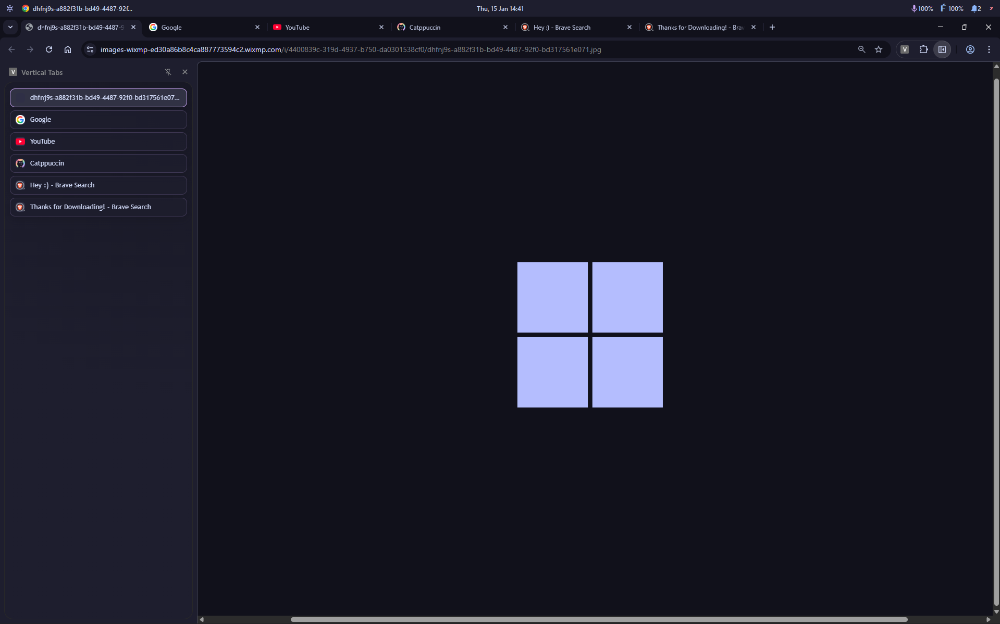

# Vertical Tabs

Lightweight MV3 side panel extension that shows a vertical list of tabs for the current window.

## Features
- Vertical tab list with active state
- Drag and drop reorder
- Audio and mute badges
- Live sync with tab changes
- Multi-select tabs with group move and close
- Light, dark, and Catppuccin themes
- No external dependencies

## Screenshot

## Install (Developer Mode)
1. Open `chrome://extensions`.
2. Enable "Developer mode".
3. Click "Load unpacked" and select this folder.
4. Click the extension icon to open the side panel.

## Usage
- Click the extension icon to open the side panel.
- Move the side panel to the left via the panel menu (three dots) > Move panel to left, or Chrome Settings > Appearance > Side panel.
- Open the extension options from `chrome://extensions` to pick a theme (default is Light).
- Multi-select tabs with Ctrl/Cmd-click or Shift-click, then drag to move as a group or press Delete/Backspace to close.
- When multiple tabs are selected, a small action bar appears at the bottom for Close/Clear.

## Themes
Available themes: Light (default), Dark, Catppuccin Mocha.

To change themes:
1. Go to `chrome://extensions`.
2. Find "Vertical Tabs" and click "Details".
3. Click "Extension options".
4. Choose a theme from the dropdown.

## Chrome Web Store
- Add the store URL here after publishing: `TBD`

## Permissions
- `tabs`: required to list, activate, and reorder tabs.
- `sidePanel`: required to host the UI in the side panel.
- `storage`: required to remember the selected theme.

## Limitations
- Chrome does not allow extensions to hide the native horizontal tab strip.
- Side panel placement is controlled by user settings (left or right).

## Credits
- Catppuccin palette: https://catppuccin.com

## Development
- Files are plain HTML/CSS/JS.
- Reload the extension after changes.
